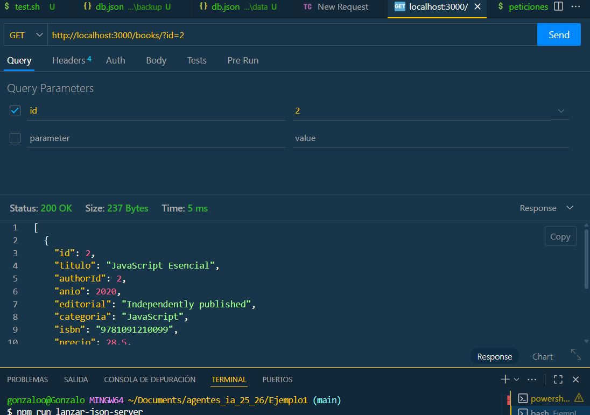
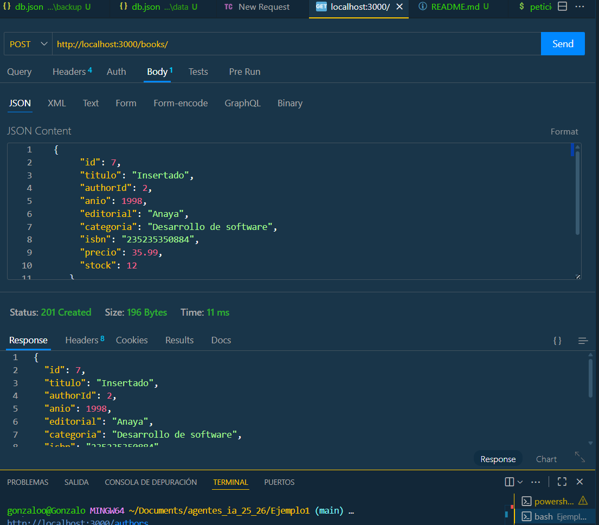
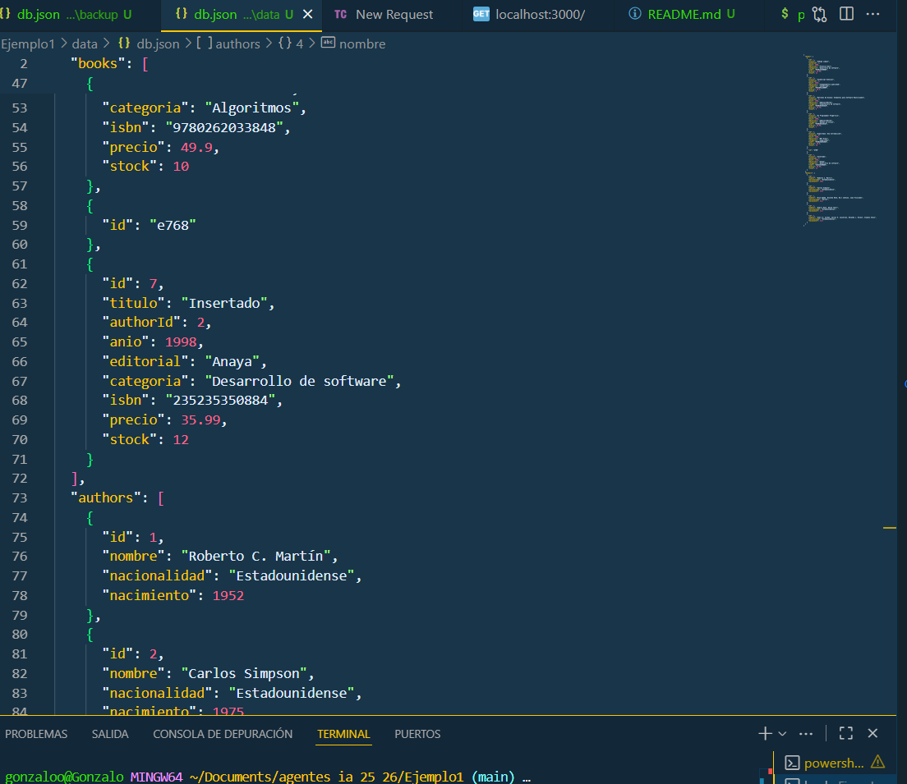
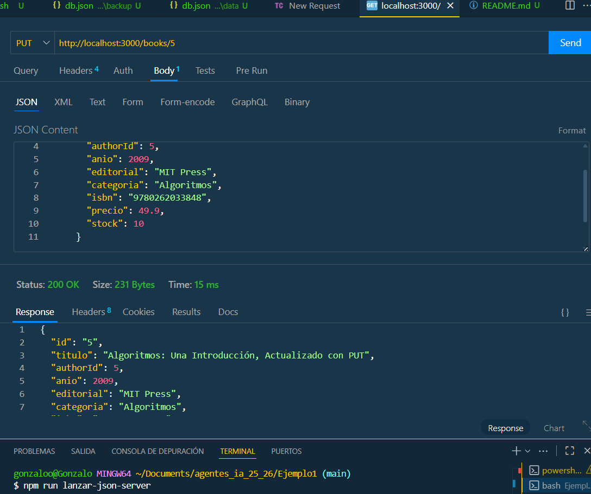
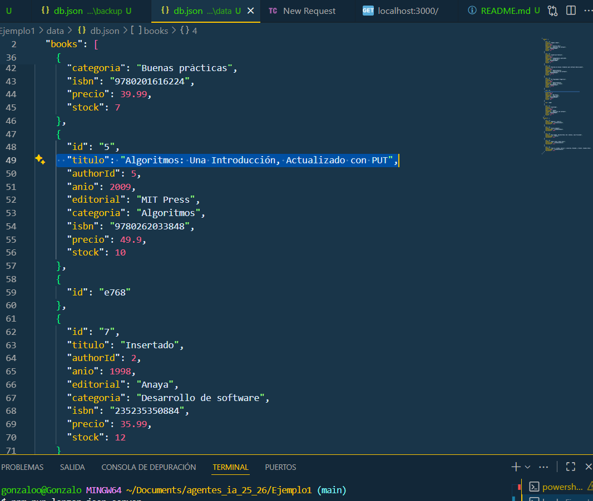
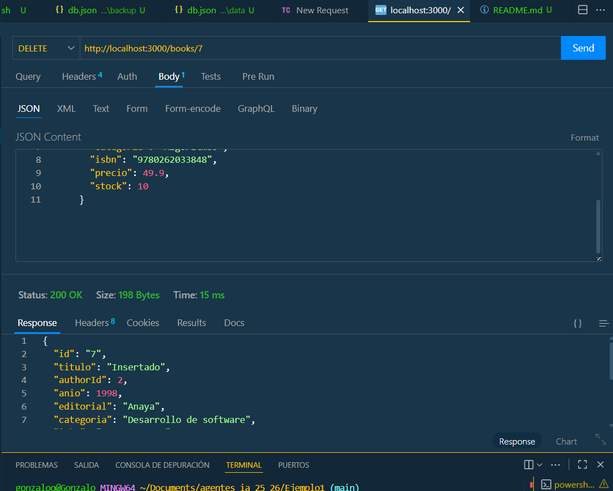
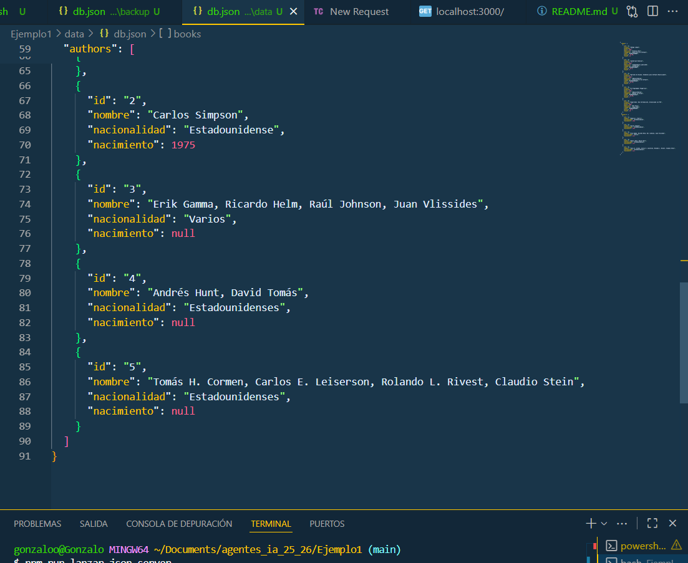

# Tarea Curl 
## Método GET

### El método GET lo usamos para obtener un dato de la base de datos.

## Método POST

### Utilizamos POST para insertar un nuevo rescurso.

 

### Y lo comprobamos.

# Método PUT

### Este método lo utilizamos para insertar un dato en nuestra base de datos 

### Comprobamos que ha salido bien 

# Método DELETE 

### Este método lo utilizamos para eliminar un dato de nuestra base de datos

### Lo comprobamos 

#### Author: Gonzalo Mansera Ruiz 